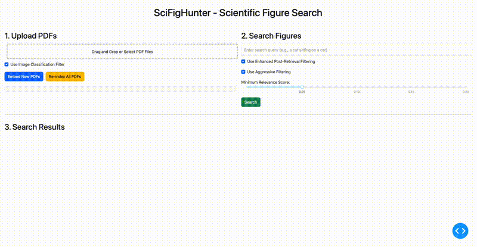

# SciFigHunter - Scientific Figure Search (Web App)

SciFigHunter is a web application that helps you locate figures from a collection of scientific PDFs. It extracts images and their potential captions from your PDF documents, embeds the images using OpenCLIP, stores them in a searchable vector database (ChromaDB), and allows you to find relevant figures using natural language queries through an intuitive web interface.

## Features

-   **🌐 Web-Based Interface:** Easy-to-use interface built with Dash and Dash Bootstrap Components.
-   **📤 PDF Upload:** Upload multiple PDF files directly through the browser.
-   **🖼️ Figure Extraction:** Automatically extracts images from PDFs using PyMuPDF.
-   **📝 Caption Association:** Attempts to extract and associate captions with figures.
-   **🧠 Advanced Embeddings:** Encodes extracted images using OpenCLIP (ViT-B-32 model) for semantic understanding.
-   **💾 Vector Storage:** Uses ChromaDB to store image embeddings and metadata for efficient searching.
-   **💬 Natural Language Search:** Find figures by describing what you're looking for.
-   **⚙️ Powerful Filtering Options:**
    -   **Pre-extraction AI Filter:** Optionally use an image classifier to filter out logos, simple shapes, and non-scientific images during the initial extraction.
    -   **Post-retrieval Filtering:** Enhance search result relevance and remove duplicates.
    -   **Aggressive Filtering:** Option to completely remove common problematic images (e.g., simple circles, known logos) from search results.
    -   **Relevance Score Threshold:** Adjust the minimum similarity score for displayed results.
-   **🔄 Re-indexing:** Easily re-index all processed PDFs from their original uploaded versions.
-   **📊 Progress Display:** See the status of PDF uploads and processing.

## Demo

```markdown

```

## Installation

1.  **Clone the repository (optional):**
    If you haven't already, get the code:
    ```bash
    git clone https://your-repository-url/scifighunter.git
    cd scifighunter
    ```

2.  **Install dependencies:**
    It's recommended to use a virtual environment.
    ```bash
    python -m venv venv
    source venv/bin/activate  # On Windows use `venv\Scripts\activate`
    pip install -r requirements.txt
    ```
    Key dependencies include:
    *   `dash`
    *   `dash-bootstrap-components`
    *   `chromadb`
    *   `open_clip_torch`
    *   `PyMuPDF`
    *   `torch` & `torchvision`
    *   `Pillow`
    *   `numpy`
    *   `opencv-python-headless`

## Usage

1.  **Run the Dash application:**
    ```bash
    python scifighunter_dash_app.py
    ```

2.  **Open your web browser:**
    Navigate to `http://127.0.0.1:8050/` (or the address shown in your terminal).

3.  **Using the Interface:**

    *   **1. Upload PDFs:**
        *   Drag and drop your PDF files into the upload area or click to select files. Uploaded PDFs are stored in the `temp_pdfs/` directory.
        *   You'll see a list of uploaded files ready for processing.
        *   **Use Image Classification Filter:** Check this box (enabled by default) to use an AI model to filter out non-scientific images (like logos or simple shapes) during the initial figure extraction process.
        *   Click **"Embed New PDFs"** to process the newly uploaded files. Images will be extracted into `output/extracted_figures/`, and embeddings will be stored in `output/chroma_db/`.
        *   Click **"Re-index All PDFs"** to clear the existing database (`output/chroma_db/` and `output/extracted_figures/`) and re-process all PDFs currently stored in the `temp_pdfs/` directory. This is useful after code changes or if you want a fresh start with the original files.

    *   **2. Search Figures:**
        *   Enter your search query in the text box (e.g., "a bar chart showing population growth").
        *   **Use Enhanced Post-Retrieval Filtering:** Check this box (enabled by default) to apply additional filtering to search results to improve relevance and remove duplicates.
        *   **Use Aggressive Filtering:** Check this box (enabled by default) to more aggressively remove common non-figure images (like circles or logos) from the search results.
        *   **Minimum Relevance Score:** Adjust the slider to set the minimum similarity score for results to be displayed. Higher scores mean more stringent matching.
        *   Click **"Search"**.

    *   **3. Search Results:**
        *   Relevant figures will be displayed as cards, showing the image, source PDF, page number, relevance score, image size, and extracted caption.

## How It Works

1.  **PDF Upload & Temporary Storage:** PDFs uploaded via the web interface are stored in the `temp_pdfs/` directory. This allows for re-indexing without needing to re-upload the original files.
2.  **Figure & Caption Extraction (`scifighunter_core.py`):**
    *   When "Embed New PDFs" or "Re-index All PDFs" is clicked, PyMuPDF is used to parse each PDF (from `temp_pdfs/` for re-indexing, or newly uploaded paths for embedding).
    *   It extracts images and attempts to identify associated captions based on proximity and textual cues.
    *   Image dimensions (width, height) are also extracted.
    *   Extracted image files are saved in the `output/extracted_figures/{pdf_name}/` directory.
3.  **Optional Pre-Extraction Image Classification (`scifighunter_advanced_filters.py`):**
    *   If enabled, a lightweight image classifier (using a pre-trained model) attempts to identify and discard images that are likely logos, simple geometric shapes, or otherwise non-scientific figures before they are embedded.
4.  **Image Embedding (`scifighunter_core.py`):**
    *   Extracted images (that pass the optional classification filter) are processed by the OpenCLIP model (specifically "ViT-B-32" pre-trained on "laion2b_s34b_b79k").
    *   This model generates a numerical vector (embedding) that represents the semantic content of the image.
5.  **Storage in ChromaDB (`scifighunter_core.py`):**
    *   The image embeddings, along with metadata (image file path, PDF name, page number, extracted caption, width, height), are stored in a ChromaDB collection.
    *   ChromaDB is a vector database that allows for efficient similarity searches. Data is persisted in the `output/chroma_db/` directory.
6.  **Search Process (`scifighunter_dash_app.py` & `scifighunter_core.py`):**
    *   When you enter a search query, the text query is also embedded using the same OpenCLIP model.
    *   ChromaDB performs a similarity search, comparing the query embedding against all stored image embeddings to find the most similar images.
7.  **Optional Post-Retrieval Filtering (`scifighunter_advanced_filters.py`):**
    *   If enabled, the initial search results from ChromaDB are further processed. This can involve:
        *   Removing near-duplicates.
        *   Filtering out images identified as problematic (e.g., publisher logos, simple shapes if aggressive filtering is on) based on metadata or simple image analysis.
        *   Potentially re-ranking based on caption relevance (though the primary search is image-similarity based).
8.  **Displaying Results (`scifighunter_dash_app.py`):**
    *   The filtered and scored results are displayed in the web interface.

## Project Structure

```
scifighunter/
├── scifighunter_dash_app.py   # Main Dash application script
├── scifighunter_core.py       # Core logic for extraction, embedding, search
├── scifighunter_advanced_filters.py # Image classification and post-retrieval filters
├── requirements.txt           # Python dependencies
├── assets/                    # Optional: For custom CSS or JavaScript for Dash app
│   └── custom_styles.css
├── temp_pdfs/                 # Temporary storage for uploaded PDFs (used for re-indexing)
├── output/                    # Main output directory
│   ├── extracted_figures/     # Stores extracted image files
│   │   └── {pdf_name}/
│   │       └── {image_file.png}
│   └── chroma_db/             # ChromaDB persistent storage
└── README.md                  # This file
```
**Note on `temp_pdfs/`:** This directory stores the original PDF files you upload. It is used by the "Re-index All PDFs" feature. If you are concerned about disk space and do not plan to use the re-index feature frequently for older files, you could manually clear this directory. However, doing so means you would need to re-upload those PDFs if you wish to re-index them later.

## Roadmap Ideas

*   **Improved Caption-based Search:** Enhance search to leverage caption text more directly alongside image similarity.
*   **Reverse Image Search:** Allow users to upload an image to find similar figures.
*   **Batch Export:** Option to export search results (images and metadata).
*   **User Accounts/Sessions:** For multi-user environments or persistent user-specific data.
*   **Advanced Analytics:** Provide insights into the figure collection.

## License

MIT

## Acknowledgments

*   [OpenCLIP](https://github.com/mlfoundations/open_clip)
*   [ChromaDB](https://www.trychroma.com/)
*   [Dash](https://dash.plotly.com/) & [Dash Bootstrap Components](https://dash-bootstrap-components.opensource.faculty.ai/)
*   [PyMuPDF](https://github.com/pymupdf/PyMuPDF)
*   [Pillow](https://python-pillow.org/)
*   The broader open-source AI/ML community.
